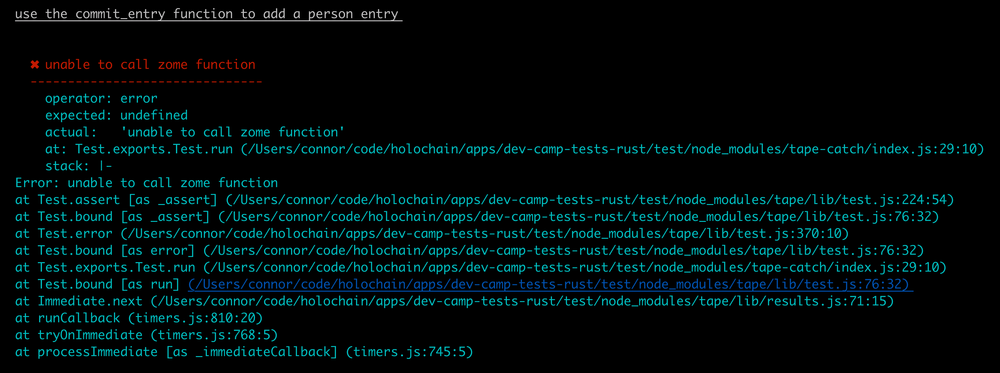

# Solution

Welcome to the solution branch!

Here is a link to the completed [lib.rs file](zomes/people/code/src/lib.rs).

Note that this is only ONE of many possible ways to have written this code, so if your code doesn't look like this, that doesn't mean that it's wrong.

Congratulations on writing code that implements a minimalistic social graph!

# Learn to Build with Holochain Rust

This repository is a tool for learning about writing apps with Holochain.

It uses a pattern called "test driven development" for teaching. This is where there are predefined "tests", which define how the application should behave, and which functions should exist. When you run the tests, you will see descriptions of that functionality, alongside the expected result. 

As a developer in training, it is your job to work to implement the functionality to get the tests passing.

There is boilerplate code already in place so that you can focus on the interesting parts.

Once you make a change in the code, you will rerun the command that runs the tests.

The test file is located in `test/index.js`.

## Instructions

Make sure Holochain is [installed](https://developer.holochain.org/start.html)

Download this repository to your computer.

Open a terminal. 

Change directories in your terminal this apps folder on your computer, wherever it was downloaded to. (Use or lookup `cd` command if you're not familiar)

If you are on Windows, open Git Bash, and run

```shell
sh ./run-test.sh
```

If you are on Mac or Linux, just run

```shell
./run-test.sh
```

You will see that all the tests are failing.


At the moment, all the tests say "unable to call zome function" because the Zome functions don't exist.

Scroll up in your terminal so that you can see the first test. It looks like this:

First, read the description of the test, "use the commit_entry function to add a person entry". Then, compare the "expected: " result, with the "actual: " result. They are different, and we want them to be equal. This will mean implementing the function.

Next, open up a code editor like Atom, Sublime Text, or VSCode, and open this app folder as a project in your editor. From the file tree, open `/test/index.js` in your code editor. Look at the first test:


What does this all mean?
- The string "use the commit_entry function to add a person entry" is a description for people to read of what the test is supposed to do
- `app.call` is how we can actually test the exposed functions of our app
- `people` is a reference to which Zome this call is to, we have one called "people"
- `main` is 
- `add_person` is the name of the function which this test calls
- `{ name: "Bonnitta" }` is the value the test will pass to the function
- `bonnittaAddress` is the value we expect calling the function to result in
- `result.address` indicates that the result of calling our function should be an object which has on it the address property
- `t.equal` is using the test framework, "tape" to check equality. Note that `equal` can be used for simple comparisons, while `deepEqual` should be used to check the equality of objects and arrays
- `t.end()` declares this particular test is complete

Now, open the file `/zomes/people/code/src/lib.rs` in your code editor. This will be where you will be working to solve the tests.

Since you should already have taken the [tutorial](https://hackmd.io/jwdkYitQQGCJX3THfxO-2A) by this point, this activity is more self-directed. Use what you learned in the tutorial to go about adding an `add_person` function to the `define_zome!` section, and a `handle_add_person` function to the code.

When it says to "use `commit_entry`" function, it means to look up the `commit_entry` function in the API reference, like this: [https://developer.holochain.org/api/0.0.2/hdk/api/fn.commit_entry.html](https://developer.holochain.org/api/0.0.2/hdk/api/fn.commit_entry.html). This will tell you how to use this function, what it does, and show you an example. Use that knowledge to write the code to make the function work as expected.

When you've written the code, go back to the terminal and run the `run-test.sh` command again, same as first instructed. If you've succeeded, the terminal will say that only 4 tests failed, down from 5, and show this result for the first test, if you scroll up to it.


Repeat this for all the remaining tests one by one until they are all passing. If you get really stuck, or you've completed it and want to see the solutions, check them out in the [solution branch of this repository](https://github.com/holochain/dev-camp-tests-rust/tree/solution).

